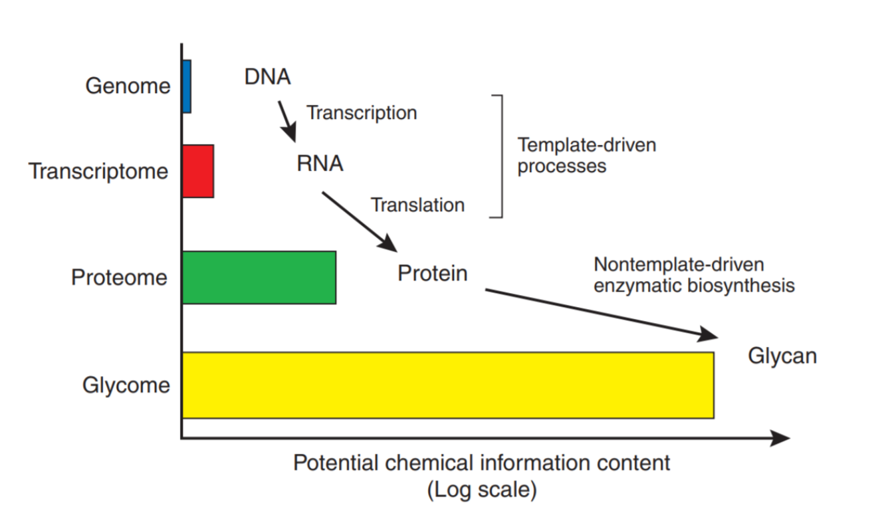
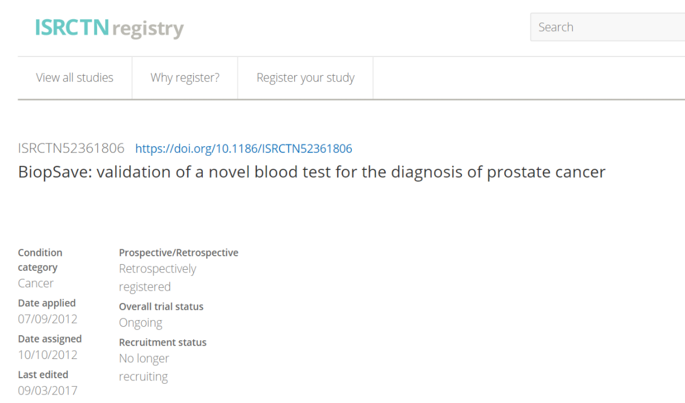

Our measurement platform targets the proteome and protein isoforms (mainly the glycome).  There is higher information content and, as the biological processes are not template driven, a large proportion of the information is not visible from genome analysis. To a large degree, the glycome that can be expressed by an individual, cannot be predicted from the genome.

We selected urological neoplasms as the target area and all samples would be from referred patient populations on an intention to treat basis. There would be no ‘healthy’ recruitment groups and no ‘convenience samples’. This would be the populations the clinicians had to differentiate in routine clinical practice. The discovery study did deviate from pure standard practice in that cancers were enriched from pre-surgery lists etc. and the samples were spun down and stored at -80$^o$C within 45 mins of venepuncture.

* _this listing no longer appears on the CRUK site. NOTE: CRUK provided the overview for information purposes only and was not involved in the study design or execution._

The discovery study collected around 1000 samples from our primary clinical site and 250 from our secondary.

http://www.isrctn.com/ISRCTN52361806

This study recruits directly from the clinical need population (i.e. the PSA diagnostic grey area). The study is designed with two interim recruitment arms, each powered to deliver the primary endpoint. 

The study is blinded and provides a low bias assessment of the performance of a new test. It can be used to calibrate the performance in a given population. Similar calibration studies may be required in different genetic populations. 

