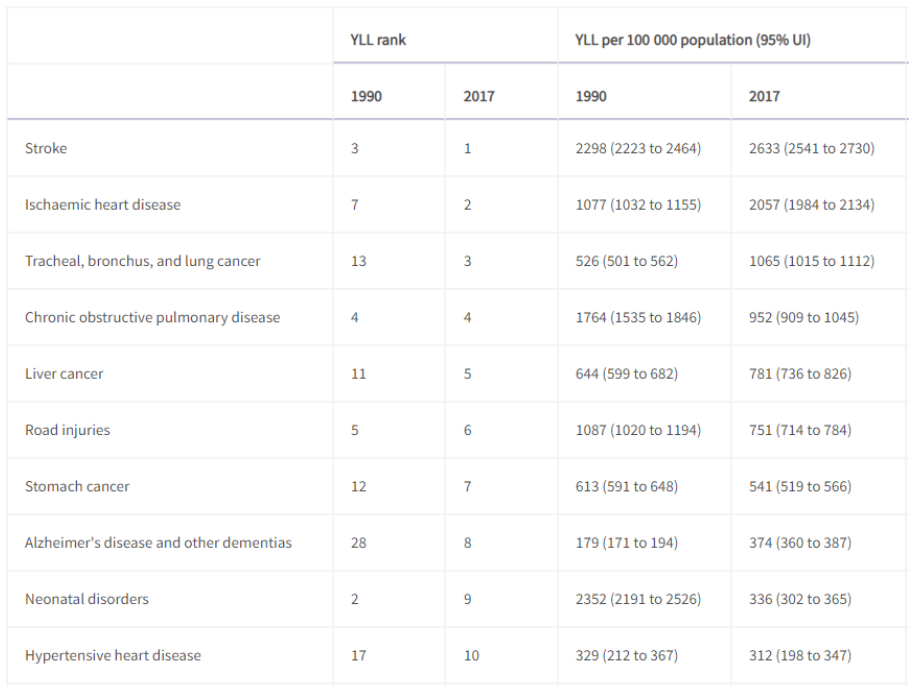
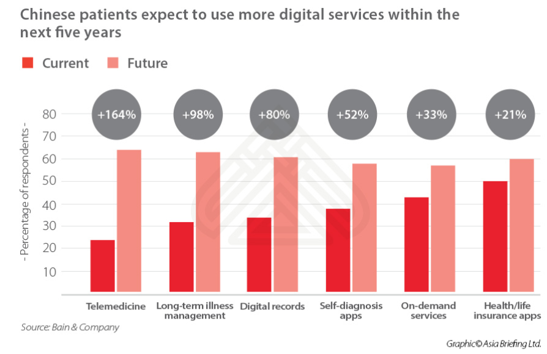

**Business case**

* China is estimated to be the second largest health industry behind the USA.[^1]

*   It increased 10% between 2018 and 2019, with rapid growth over the last five years. In 2019 it was estimated to be worth US$1.1 trillion.

**Ageing populations…**

*   “The global population aged 60 years or over numbered 962 million in 2017, more than twice as large as in 1980 when there were 382 million older persons worldwide. The number of older persons is expected to double again by 2050, when it is projected to reach nearly 2.1 billion.”[^2] “Globally, the number of older persons is growing faster than the number of people in all younger age groups.”

*   China’s population is 1,439,323,776 in 2020, with 11.5% aged over 65 with an estimated annual growth rate of 2.3%[^3]. 

**Mortality rates in China**[^4]

* _YLL_ is years of life lost

We have chosen to focus on areas that have a need, and where there is evidence in the literature that our technology is an effective way of identifying the disease.

We therefore have focussed on **COPD** (fourth leading cause of death in China), **Alzheimer’s Disease** and other dementia’s (unmet need / current challenges to diagnosis, increased YLL rank between the years of 1990 and 2017, which is also consistent with an increased ageing population), and **Rheumatoid Arthritis**, which, whilst does not directly lead to death, is strongly associated with a shortfall between life expectancy and healthy life expectancy.

Government policies, such as Healthy China 2020 and 2030, have been put in place to promote risk reduction and encourage healthier lifestyles[^5], and to address health inequity in the overall population.Health outcomes in China continue to be dependent upon geography[^6].

**Digital Health Providers**

*   The Bain & Company survey, completed in 2019, estimated that 24% of Chinese respondents had used telemedicine.
*   PingAn Good Doctor, the largest “online medical service” provider in China, saw their online medical services revenue grow by over 100% in the 12 months to August 2020, with a 26% increase in daily online consultations over the same period[^7]. 

  

<!-- Footnotes themselves at the bottom. -->
## Notes

[^1]: [https://www.china-briefing.com/news/china-investment-outlook-telemedicine-digital-healthcare-industry/](https://www.china-briefing.com/news/china-investment-outlook-telemedicine-digital-healthcare-industry/) accessed 19/10/20

[^2]: [World Ageing population 2017, United Nations](https://www.un.org/en/development/desa/population/publications/pdf/ageing/WPA2017_Highlights.pdf)

[^3]:[https://knoema.com/atlas/China/Population-aged-65-years-and-above](https://knoema.com/atlas/China/Population-aged-65-years-and-above), accessed 17.04.20

[^4]: doi.org/10.1016/S0140-6736(19)30427-1

[^5]: Tan X, Liu X, Shao H, Healthy China 2030: a vision for health care. Value Health Reg Issues. 2017; 12: 112-114

[^6]: doi.org/10.1016/S0140-6736(19)30427-1

[^7]: (https://www1.hkexnews.hk/listedco/listconews/sehk/2020/0820/2020082000445.pdf)

