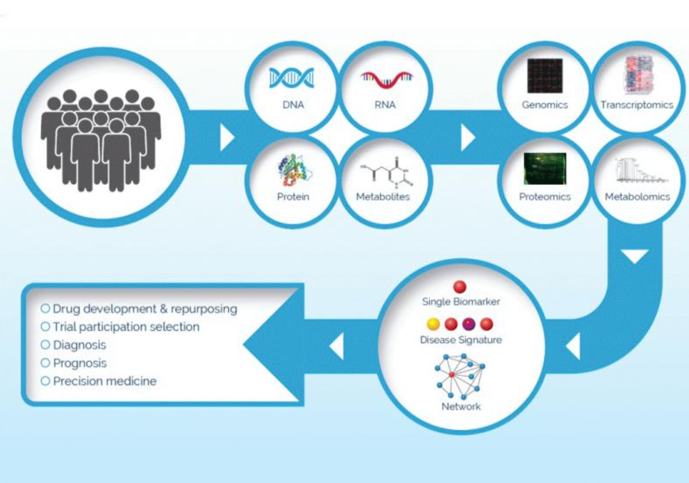

# Our technology

## Overview publication in Drug Discovery World, 26 December 2019

https://www.ddw-online.com/harnessing-the-modified-proteome-for-increased-diagnostic-power-928-201912/

## Technical background

[Early predictive AI demonstration](References/ABRF2007_Predictive.pdf)

[Demonstrating cross lab reproducibility potential](References/SienaPoster_2008.pdf)

[Considerations for powering a clinical proteomics study](References/Jackson et al 2009.pdf)

[Introduction to Statistical Process Control](References/SPC in Proteomics Bramwell JProt 2013.pdf)

[Statistical Process Control for complex samples](References/SPC in Proteomics workflow Bramwell and Jackson JProt 2013.pdf)

# Disease areas

## Chronic obstructive pulmonary disease (COPD)

## Alzheimer’s Disease

## Rheumatoid Arthritis

