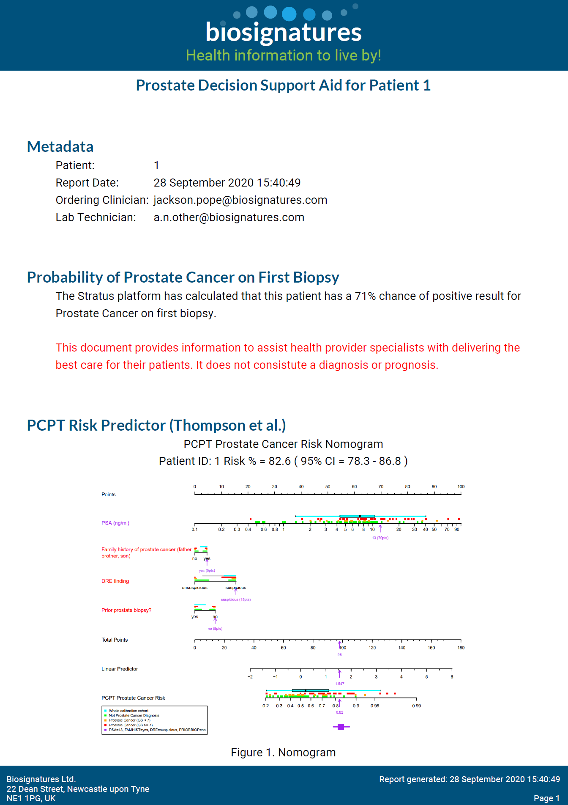

```{r copyFilesOver,echo=FALSE,include=FALSE}
require(waffle)

reportDir <- "../BiosignaturesR/"

CopyReportPair <- function(fileStub,reportDir) {
  htmlFile <- normalizePath(paste(reportDir,paste(fileStub,"html",sep="."),sep="/"))
  file.copy(htmlFile,
            normalizePath("./"),overwrite=T)
  
  pdfFile <- normalizePath(paste(reportDir,paste(fileStub,"pdf",sep="."),sep="/"))
  file.copy(pdfFile,
            normalizePath("./"),overwrite=T)
  
  # remove the copied figure folders in AuditLabReport_files as they are big and aren't needed
  try({
    unlink(normalizePath(paste("./",fileStub,"_files/figure-html/*.*",sep="")),recursive=T,force=T)
    unlink(normalizePath(paste("./",fileStub,"_files/figure-latex/*.*",sep="")),recursive=T,force=T)
  })
  return(list(htmlFile=htmlFile,pdfFile=pdfFile))
}

audRep <- CopyReportPair("AuditLabReport","../BiosignaturesR/")
anaRep <- CopyReportPair("AnalyteDetails","../BiosignaturesR/")


```

The platform generates standardised reports with focused information for the differing needs across the ecosystem. In this section we show examples that may be produced. 

# Health professionals in the digital health provider

This report is focused on clinical information from the blood sample. It may be specific to a specific disease or provide health insights for multiple conditions.

An example health professional focused diagnosis report is shown below:


```{r  out.width = "50%",fig.align='center',echo=FALSE}
 
```

([pdf](ProstateExample.pdf))

# Health providers to use in consultation

Statements such as "a 71% risk of prostate cancer being found if you have a prostate biopsy' have been shown to be difficult for people to visualise. More so in stressful situations such as getting results of tests.

Tailored reports will also be provided, suitable for different disease types that have more visual aids and information.

```{r  out.width = "50%",fig.align='center',echo=FALSE}
 parts <- c("No Cancer"=25,"Cancer"=71,"Low risk"=4)
 chart <- waffle(parts, rows=10,title="In 100 men with a Prostate Biopsave value around your level")
 print(chart)
```


# Analyte focused Lab Report 

This provides detailed informaiton for the labs to verify the quality of their results and provide audit details for quality system oversight.

The report is a mock up example and fewer or additional analytes and derived details may be provided.


Audit Lab Report ([Html `r file.info(audRep$htmlFile)[["mtime"]]`](AuditLabReport.html) : [Pdf `r file.info(audRep$pdfFile)[["mtime"]]`](AuditLabReport.pdf))


<!-- # very technical report won't go on site -->
<!-- #Analyte Details ([Html `r file.info(anaRep$htmlFile)[["mtime"]]`](AnalyteDetails.html) : [ pdf `r file.info(anaRep$pdfFile)[["mtime"]]`](AnalyteDetails.pdf)) -->


