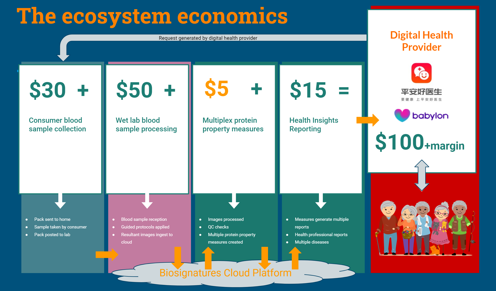

```{r setup,echo=FALSE,include=FALSE}
require(DiagrammeR)

```

## Ecosystem Overview




Let’s take a relatively standard workflow, we start at the right with the individual who wants to proactively take control of their health. They will have sought a digital health platform and, after initial discussions with a physician on the platform, decide to order relevant testing. 

A blood sample will be taken via a blood spot test kit (though many may prefer an at home visit or to go to a local pharmacy). 

The sample will be sent to an ecosystem partner wet lab to execute the processes that generate the underlying biomarkers. Currently, this is done in our own wet lab but we are in discussion with third party labs and we plan to focus on building capacity with them rather than increasing our own. The cloud software is a key component in enabling third party labs to rapidly adopt delivery of the new measures.

Our software systems ensure the quality of the processing and perform the image data extraction. 

The measures are then combined to produce multiple disease health insights that are returned to the doctor in the digital health provider. 

There will be two levels of health insight reporting available, one for the health professional and another for the health professional to use in discussions with the patient on how best to move forward on their health journey.

In terms of the ‘economics of the platform’ we have added illustrative cost allocations across the ecosystem. These are ‘to the health provider costs’ and we assume extra margin will be added by them.

If we take \$100 per sample processed then the ‘from consumer to measures costs’ consist of around \$30 to get a sample to the lab, around \$50 to process the sample and  around \$5 for the biosignatures cloud system to extract the measures.

**Those costs are incurred once per sample** and multiple disease tests can be applied.

We are actively encouraging clinical teams to discover and validate new tests on our platform and so we would become a key component in rapidly delivering their IP to market. Given this, there will be ‘per included test licensing’ costs which we will negotiate up front as part of the collaborations. Royalty / licensing fees are are included as the \$15 Health Insights Reporting.


## Detailed Ecosystem Workflow Schematic

The protocols and analysis capabilities we have developed enable reproducible and highly automated complex multiplex analysis across the ecosystem partners.

```{r, warning=FALSE,out.height = "100%",fig.align='center',echo=F}
require(DiagrammeR)
  DiagrammeR::grViz("../BiosignaturesR/Labflow.gv",allow_subst = F)

```

